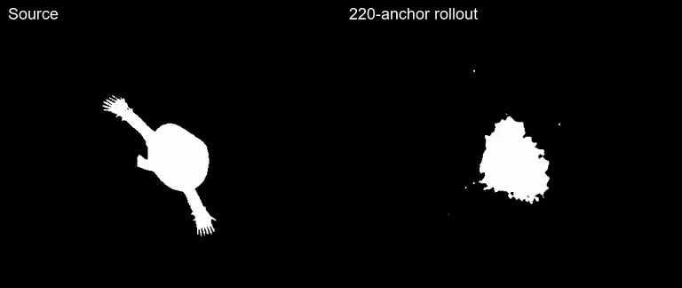
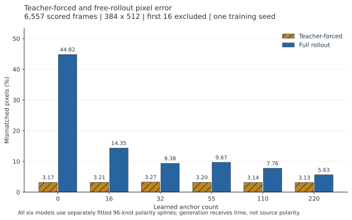
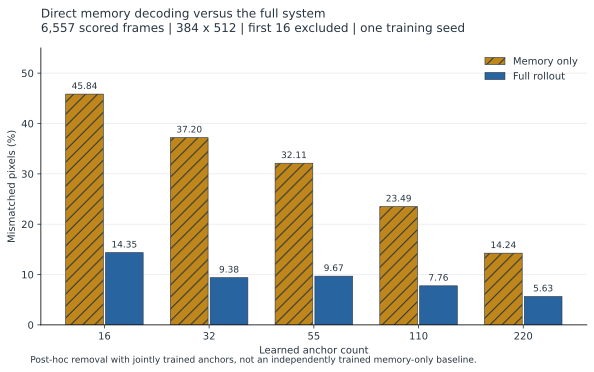
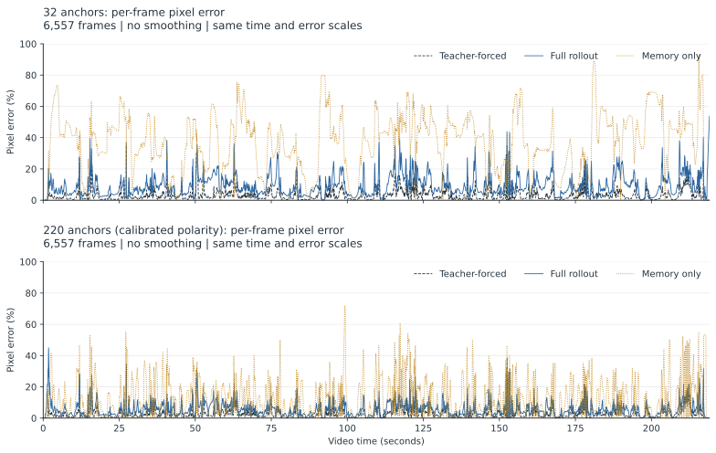
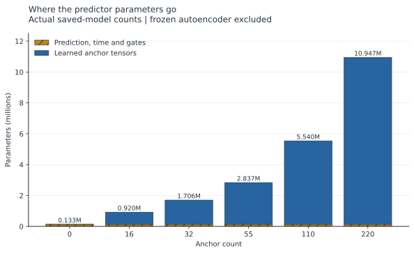

<div align="center">

<h1>Neural Network Dreams of Bad Apple</h1>

<p><strong>Give a neural network 16 real frames, take the video away, and make it finish <em>Bad Apple!!</em> from its own activations.</strong></p>

<a href="blog_assets/videos/hero_45_60.mp4">
  
</a>

<p><em>The 45–60 second prototype. Click it for the full-quality MP4.</em></p>

<p>
  <a href="https://youtu.be/hVxghEHlCzw"></a>
  <a href="https://cheeseburgerhere.github.io/cheeseburgerhere/bad-apple/"></a>
</p>
<!-- 
<p>
  
  
  
  
  
</p> -->

<p>
  <a href="#architecture">🧠 Architecture</a> ·
  <a href="#teacher-forcing-is-not-rollout">📉 Results</a> ·
  <a href="#is-it-just-playing-back-the-anchors">🧪 Memory ablation</a> ·
  <a href="#run-it">🚀 Run it</a> ·
  <a href="colab_anchor_ablation.ipynb">☁️ Colab</a> ·
  <a href="#honest-limitations">⚠️ Limitations</a> ·
  <a href="#credits">🙏 Credits</a>
</p>

</div>



This is a small PyTorch experiment about **autoregressive error accumulation**. A convolutional autoencoder first turns each black-and-white frame into a latent grid. A temporal model then predicts the next latent from its recent history. After a 16-frame warmup—about half a second—the source is removed and every prediction is fed back into the model.

The fun part is watching the dream drift. The useful part is measuring why it drifts, and how much learned scene memory is needed to keep it recognizable.

The final 220-anchor run reaches **5.63% mean pixel error** over the full 219.1-second rollout. With no anchors, the same kind of model collapses to **44.82% error**, despite having almost the same one-step teacher-forced error.

## What the model sees

The model is trained on one known video. It is not a general text-to-video system and it does not receive audio. At inference time it has:

- the first 16 source frames;
- its own previous latent predictions;
- the current timestamp;
- learned scene anchors tied to points on this video's timeline.

“Dreaming” is the name used here for free-running inference, not a claim about what the network experiences.

Every displayed pixel is a thresholded decoder activation:

```text
activation >= 0.5  ->  white
activation <  0.5  ->  black
```

## Architecture

```text
source frame (384 x 512)
          |
          v
 frozen convolutional encoder
          |
          v
 latent grid (64 x 24 x 32)
          |
          +----------------------- rolling history of 16 grids
                                      + frame-to-frame differences
                                                   |
                                                   v
                                temporal U-Net (time: 16 -> 8 -> 4 -> 8 -> 16)
                                                   |
                                                   v
                                slow velocity + masked fast velocity
                                                   |
previous predicted latent -------------------------+
                                                   |
                                                   v
                                         motion candidate
                                                   |
time -> Fourier features -> two nearby learned scene anchors
                                                   |
                                                   v
                                spatially gated memory correction
                                                   |
                                                   v
                                      next predicted latent
                                          |              |
                                          |              +--> feed back into history
                                          v
                                  frozen decoder + polarity
                                          |
                                          v
                                 black-and-white frame
```

The temporal U-Net compresses **time**, not the spatial latent grid. Skip connections preserve short local movement, while the bottleneck summarizes the full recent history.

The motion path predicts a change rather than a whole new state:

$$
u_t = \hat z_{t-1} + v_t^{\text{slow}} + M_t \odot v_t^{\text{fast}}.
$$

The slow branch handles stable whole-shape motion. The fast branch has a larger range but is restricted by a learned motion mask $M_t$, aiming it at hands, wings, edges, and other locally changing regions.

For longer-term scene structure, the model interpolates the two learned anchors nearest the current time:

$$
m_t = \sum_{i \in \mathcal N_2(t)} a_i(t)A_i.
$$

It then softly corrects the motion prediction toward that memory:

$$
\hat z_t = u_t + g_t \odot (m_t-u_t).
$$

The gate $g_t$ varies across the latent grid. This is deliberately a **bleed**, not a hard reset: prediction mistakes remain visible as the remembered next scene enters.

A separate time-conditioned polarity head restores global black/white inversions after the canonicalized latent has been decoded.

More detail is available in [the architecture note](blog_assets/architecture.md).

## Teacher forcing is not rollout

The same checkpoint is evaluated in two modes:

- **Teacher-forced:** each prediction receives the correct source history.
- **Free rollout:** after warmup, each prediction receives only the model's earlier predictions.

This distinction produced the clearest result in the project. One-step error barely changes with memory size, while long-rollout error changes dramatically:

| Scene anchors | Teacher error | Free-rollout error | Class-mean IoU |
| ---: | ---: | ---: | ---: |
| 0 | 3.17% | 44.82% | 0.329 |
| 16 | 3.21% | 14.35% | 0.643 |
| 32 | 3.27% | 9.38% | 0.741 |
| 55 | 3.20% | 9.67% | 0.745 |
| 110 | 3.14% | 7.76% | 0.776 |
| 220 | **3.13%** | **5.63%** | **0.828** |

Scores exclude the 16 warmup frames and use 6,557 generated frames at 30 fps and 384 × 512 resolution. Pixel error is the mean fraction of thresholded pixels that disagree with the source. These are single-seed reconstruction results, not a general benchmark.

[Watch the zero-anchor collapse](blog_assets/videos/collapse_zero_45_60.mp4) · [Watch all anchor budgets](blog_assets/videos/anchor_budget_full.mp4) · [Download the per-frame results](blog_assets/tables/01_quality.csv)

## Is it just playing back the anchors?

That was my biggest concern too. A single anchor contains 49,152 learned values, and the 220-anchor model stores 10,813,440 anchor parameters. About 98.8% of its predictor parameters are memory.

So I removed history, temporal prediction, and fusion, then decoded the same learned anchors directly:

```text
full model:   history + time -> motion -> memory fusion -> decoder
memory only:            time -> anchor interpolation -> decoder
```



| Anchors | Memory-only error | Full-model error | Relative error reduction |
| ---: | ---: | ---: | ---: |
| 16 | 45.84% | 14.35% | 68.7% |
| 32 | 37.20% | 9.38% | 74.8% |
| 55 | 32.11% | 9.67% | 69.9% |
| 110 | 23.49% | 7.76% | 67.0% |
| 220 | 14.24% | 5.63% | 60.4% |

The full system beats direct memory decoding at every tested budget. That does **not** prove semantic understanding, and the memory-only path was removed after training rather than optimized as its own model. It does show that the result is not equivalent to simply decoding the anchor interpolation.

[Watch the 32-anchor ablation](blog_assets/videos/memory_32_45_60.mp4) · [Watch the 220-anchor ablation](blog_assets/videos/memory_220_45_60.mp4)

## Error still accumulates



Averages hide scene cuts and small local failures. The model can preserve a large silhouette while missing fingers, wings, or moving edges. It can also learn the correct scene motion but fail to recover once its own latent state has drifted.

That led to an important distinction:

$$
v_{\text{scene}} = z_t-z_{t-1}, \qquad
v_{\text{recovery}} = z_t-\hat z_{t-1}.
$$

If the predicted previous state $\hat z_{t-1}$ is already wrong, teaching only the true scene velocity may move in the right direction without returning to the right state. A small v4.3 fine-tune using state-relative recovery targets improved full-rollout latent MSE from 0.3375 to 0.3268, but a second epoch began to regress. Recovery and ordinary next-frame motion are related, but not identical jobs.

## Parameter budget



| Component in the 220-anchor system | Parameters |
| --- | ---: |
| Frozen autoencoder | 167,665 |
| Temporal U-Net | 116,256 |
| Time features, heads, and gates | 16,934 |
| Learned anchor values | 10,813,440 |
| Predictor total, excluding autoencoder | 10,946,630 |

The final model is effective but not compact. The project is best read as a controlled reconstruction and failure-analysis experiment, not as a new video codec.

## Run it

### Requirements

- Python 3.10 or newer
- PyTorch 2.2 or newer
- A CUDA GPU for the larger experiments
- FFmpeg, provided automatically through `imageio-ffmpeg`
- A legally obtained copy of the original video

The source video, extracted frames, latent caches, and checkpoints are intentionally not included in Git.

```bash
git clone https://github.com/cheeseburgerhere/Neural-Network-Dreams-of-Bad-Apple.git
cd Neural-Network-Dreams-of-Bad-Apple

# Install PyTorch for your platform first: https://pytorch.org/get-started/locally/
python -m pip install -r requirements.txt
```

### Start with the 45–60 second prototype

```bash
python prototype.py extract \
  --input /path/to/bad_apple.mp4 \
  --start 45 --end 60 --fps 30

python prototype.py train \
  --model basic \
  --height 384 --width 512 \
  --batch-size 4 \
  --run-dir prototype_runs/basic_full

python prototype.py reconstruct \
  --checkpoint prototype_runs/basic_full/model_best.pt
```

For a quick CPU/GPU smoke test, use one epoch and a smaller image:

```bash
python prototype.py train \
  --model basic --epochs 1 \
  --height 96 --width 128 \
  --base-channels 8 --latent-channels 32
```

### Train the full long-horizon model

First extract the full 219.1-second sequence:

```bash
python prototype.py extract \
  --input /path/to/bad_apple.mp4 \
  --output-dir prototype_data/full_source_frames \
  --manifest prototype_data/full_manifest.json \
  --start 0 --end 219.1 --fps 30
```

The frozen autoencoder checkpoint must exist at `prototype_runs/basic_full/model_best.pt`. The exact 220-anchor training settings used for the headline result were:

```bash
python prototype.py train-hybrid-v42 \
  --anchors 220 \
  --run-dir prototype_runs/anchors_220 \
  --epochs 12 --batch-size 16 \
  --learning-rate 3e-4 \
  --seed 7 --device cuda
```

This uses up to 128 burn-in steps and supervised rollouts growing from 4 to 32 frames. It is expensive; start with the prototype or reduce the anchor count while developing.

Render the raw checkpoint, fit the time-only polarity calibration from that render, then render the calibrated checkpoint:

```bash
python prototype.py rollout-ar \
  --checkpoint prototype_runs/anchors_220/model_best.pt \
  --data-dir prototype_data/full_source_frames \
  --output-dir prototype_outputs/anchors_220_raw

python prototype.py fix-polarity \
  --checkpoint prototype_runs/anchors_220/model_best.pt \
  --target-csv prototype_outputs/anchors_220_raw/error_curve.csv \
  --run-dir prototype_runs/anchors_220_polarity

python prototype.py rollout-ar \
  --checkpoint prototype_runs/anchors_220_polarity/model_best.pt \
  --data-dir prototype_data/full_source_frames \
  --output-dir prototype_outputs/anchors_220_final
```

Run the tests:

```bash
python -m unittest discover -s tests
```

The [Colab notebook](colab_anchor_ablation.ipynb) packages the anchor-budget experiment for a hosted GPU. Because the original development repository was private, its setup cells use a source ZIP from Google Drive; update those Drive paths before running it.

## Repository map

```text
prototype.py                 command-line entry point
neural_bad_apple/
  models.py                  autoencoders
  autoregressive.py          ConvGRU baseline
  hybrid_v4.py               temporal U-Net, anchors, and v4.x training
  drift_rendering.py         teacher/rollout/error-map renderer
  polarity.py                temporal polarity tracking and calibration
  recovery.py                state-recovery fine-tuning
  memory_baseline.py         direct-anchor ablation
prototype_data/              manifests; generated frames and caches are ignored
prototype_runs/              lightweight experiment reports; weights are ignored
prototype_outputs/           selected reports; generated renders are ignored
blog_assets/                 public figures, tables, videos, and full write-up
tests/                       pipeline and export checks
```

Training and rendering are deliberately separate. Each idea—autoencoder, temporal predictor, memory, polarity correction, recovery objective, and renderer—can be changed without rebuilding the whole project.

## Honest limitations

- The system reconstructs **one memorized timeline** and has not been tested on unseen videos.
- Absolute time and learned anchors reveal where the model is in that timeline.
- There is one training seed per anchor budget, so small differences such as 32 versus 55 anchors are not statistically meaningful.
- Pixel error favors large flat backgrounds and can hide ugly contour or local-motion failures.
- The memory-only comparison is post-hoc; a separately trained playback baseline could be stronger.
- The autoencoder was trained on the original 45–60 second prototype and reused frozen for the full video.

Those limitations are part of the point: the repository keeps teacher-forced, free-rollout, memory-only, polarity, and per-frame measurements separate so it is harder to hide collapse behind one attractive clip.

## Read more

- [The full, informal project write-up](blog_assets/BLOG_POST.md)
- [Architecture notes](blog_assets/architecture.md)
- [All result tables](blog_assets/tables/all_tables.md)
- [Per-frame anchor-budget measurements](blog_assets/tables/anchors_220_polarity_per_frame.csv)
- [Valérien Braye's GPT-2 attention-map project](https://brayevalerien.com/blog/bad-apple-but-its-gpt2/)
- [The LocalLLaMA discussion that suggested previous-frame generation](https://www.reddit.com/r/LocalLLaMA/comments/1r5lra1/bad_apple_but_its_gpt2_xl_attention_maps/)

## Credits

This repository contains a model and derived experimental comparisons. The original composition is by ZUN. The well-known arrangement is by Alstroemeria Records with vocals by nomico, and the shadow-art PV was created by あにら. See the [official song release](https://www.youtube.com/watch?v=_aTq73Oz2hU) and [original Nico Nico upload](https://www.nicovideo.jp/watch/sm8628149).

The music and animation are not my work and remain the property of their respective creators. The source video is not redistributed.

If you publish or fork this project, please keep those credits clear and provide your own legally obtained source video.
